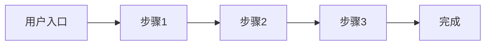
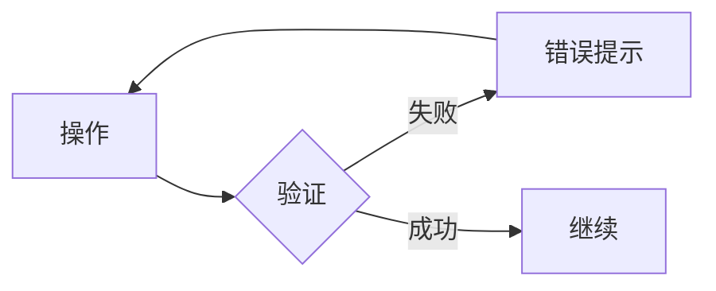

# 产品需求文档 (PRD)

## 1. 项目概述

| 项目 | 内容 |
|------|------|
| **项目名称** | [填写项目名称] |
| **版本** | 0.1.0 |
| **日期** | YYYY-MM-DD |
| **状态** | 草案 / 评审中 / 已批准 |
| **负责人** | [姓名] |

---

## 2. 背景与目标

### 2.1 问题陈述

[描述这个项目要解决的核心问题，用户当前的痛点是什么]

### 2.2 成功指标 (KPI)

- [指标1]: [具体数值目标]
- [指标2]: [具体数值目标]
- [指标3]: [具体数值目标]

---

## 3. 用户画像

### 3.1 主要用户

| 属性 | 描述 |
|------|------|
| **角色** | [如：初级开发者、产品经理] |
| **年龄/职业** | [如：25-35岁，互联网从业者] |
| **目标** | [使用产品想要达成什么] |
| **痛点** | [当前面临的困难] |
| **技术熟练度** | [高/中/低] |

### 3.2 次要用户（如有）

| 属性 | 描述 |
|------|------|
| **角色** | |
| **年龄/职业** | |
| **目标** | |
| **痛点** | |
| **技术熟练度** | |

---

## 4. 功能需求

### 4.1 核心功能 (Must Have)

#### 功能 1: [功能名称]
- **描述**: [功能的具体描述]
- **验收标准**:
  - [ ] 标准1
  - [ ] 标准2
  - [ ] 标准3

#### 功能 2: [功能名称]
- **描述**: 
- **验收标准**:
  - [ ] 
  - [ ] 

### 4.2 扩展功能 (Nice to Have)

| 功能 | 描述 | 优先级 | 计划版本 |
|------|------|--------|----------|
| [功能名] | [描述] | P1/P2/P3 | v0.x.0 |

### 4.3 排除项 (Won't Have - 本阶段不做)

| 功能 | 排除原因 | 计划版本 |
|------|----------|----------|
| [功能名] | [原因] | [版本] |

---

## 5. 非功能需求

### 5.1 性能要求

| 指标 | 目标值 |
|------|--------|
| QPS (每秒查询数) | [数值] |
| 响应时间 (P95) | [数值，如：<200ms] |
| 可用性 | [如：99.9%] |
| 并发用户数 | [数值] |

### 5.2 安全要求

- **认证方式**: [如：JWT、OAuth2、Session]
- **数据加密**: [传输加密、存储加密要求]
- **权限模型**: [RBAC/ABAC等]

### 5.3 兼容性要求

- **浏览器**: [如：Chrome 90+, Firefox 88+, Safari 14+]
- **设备类型**: [如：桌面、平板、手机]
- **操作系统**: [如：iOS 14+, Android 10+]

### 5.4 合规要求

- [ ] GDPR (欧盟数据保护)
- [ ] CCPA (加州消费者隐私)
- [ ] 等保 [级别]
- [ ] 其他: [说明]

---

## 6. 用户流程

### 6.1 核心流程

### 6.2 异常流程

---

## 7. 竞品分析

| 竞品名称 | 优势 | 劣势 | 我们的差异化 |
|----------|------|------|-------------|
| [竞品1] | | | |
| [竞品2] | | | |
| [竞品3] | | | |

---

## 8. 风险与假设

### 8.1 技术风险

| 风险 | 概率 | 影响 | 缓解策略 |
|------|------|------|----------|
| [风险描述] | 高/中/低 | 高/中/低 | [策略] |

### 8.2 市场风险

| 风险 | 概率 | 影响 | 缓解策略 |
|------|------|------|----------|
| [风险描述] | 高/中/低 | 高/中/低 | [策略] |

### 8.3 资源风险

| 风险 | 概率 | 影响 | 缓解策略 |
|------|------|------|----------|
| [风险描述] | 高/中/低 | 高/中/低 | [策略] |

### 8.4 关键假设

1. [假设1：用户会愿意...]
2. [假设2：技术方案可以...]
3. [假设3：第三方服务...]

---

## 9. 附录

### 9.1 术语表

| 术语 | 定义 |
|------|------|
| [术语] | [定义] |

### 9.2 参考文档

- [文档1]
- [文档2]

### 9.3 变更历史

| 版本 | 日期 | 变更内容 | 作者 |
|------|------|----------|------|
| 0.1.0 | YYYY-MM-DD | 初始版本 | [姓名] |

